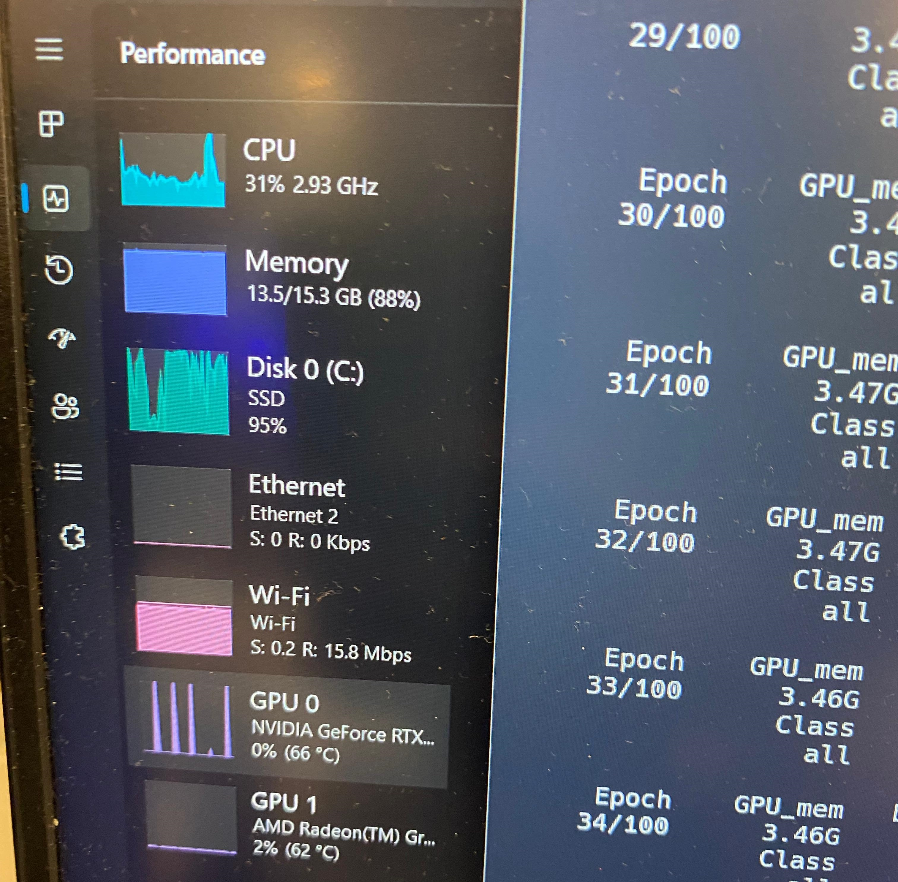

<h1 align="center">Real-Time-Fruit-Detection-YOLOv9-v8</h1>

En este repositorio encontraras ejemplos basicos de códigos para implementar detección de frutas con YOLOv8/v9 con el lenguage de programación python 🐍.

**main.py** -> Este archivo fue el proyecto completo en partes temprana del desarrollo, su código esta completamente comentado y tiene más contenido del necesario para ejecutar la deteccion de frutas, en general, es un archivo explicativo y con fines de experimentales, todos los archivos subsiguientes se basan en este.

**custom_dataset.py** -> Este archivo contiene código limpio y legible sobre como puedes ejecutar la detección de frutas en tiempo real o sobre una imagen con un modelo pre-entrenado para detectar hasta 4 frutas distintas con un dataset personalizado

**default_dataset.py** -> Este archivo es similar a custom_dataset solo que utiliza el dataset de coco con más de 122,000 imagenes para detectar hasta 79 clases distintas.

**segment_dataset.py** -> Este archivo es similar a default_dataset solo que utiliza el modelo de segmentación de YOLO para dibujar el contorno del objeto a detectar en cuestion, todo esto con el dataset de coco.

[](assets/fruit-detection-dataset.mp4)


## Setup
Necesitaras una **NPU** o **tarjeta gráfica** para ejecutar este proyecto

**Instalar** ([**Python**](https://www.python.org/downloads/))

1. **Descargar el repositorio**
  - [Presiona aquí para iniciar la descarga](https://github.com/Soy-Ismael/Real-Time-Fruit-Detection-YOLOv9-v8/archive/refs/heads/main.zip)

2. **Instalar las dependencias**
  - Abre una terminal en la raíz del proyecto y ejecutar ```pip install -r requirements.txt``` en la terminal para linux / Windows

  <!-- [")](requirements.txt) -->

  - Instala **Py Torch** para tu sistema, visita la [pagina oficial](https://pytorch.org/get-started/locally/)
  [")](https://pytorch.org/get-started/locally/)

  Debes seleccionar las opciones según tu sistema, copiar el comando debajo del recuadro y ejecutarlo en la terminal

3. **Ejecutar** el archivo **principal** ```python custom_dataset.py``` puedes hacer doble click en el para ejecutarlo, hacerlo mediante la terminal abriendola en la raíz del proyecto o mediante visual studio code si tienes la **extension "python"** instalada

<!-- [](public/va.py) -->
<!-- [](public/va.py) -->

Este proyecto fue ejecutado con el siguiente hardware:
- Ryzen 7 5800H 3.20 GHz
- 16 GB RAM DDR4 3200 MHz
- NVIDIA RTX 3050 TI 4GB (laptop)

Este proyecto se ejecuta en local por lo que usa los recursos del computador para analizar las entradas y predecir el objeto en cuestion, aquí hay un ejemplo de cuanto exige a mi hardware.
[](assets/resources_use.jpeg)

## Dataset
El dataset o conjunto de datos es la coleccion de imagenes que usaras para entrenar a tu red neuronal, lo ideal es tener alrededor de 1,000 imagenes para entrenamiento y alrededor de 200 para validación, cuantas más imagenes utilices mejor.

### Detalles
* 191 Imagenes
* 4 Clases (y sus indices)
    - 0 Manzana roja
    - 1 Banana
    - 2 Manzana verde
    - 3 Naranja

**Nota:** las clases estan en Ingles

[](assets/example-fd-g.gif)

**Nota:** el modelo fue entrenado para frutas, pero con un conjunto de datos distinto podrias utilizarlo para detectar cualquier cosa.

## Resources
Obvie algunas carpetas en este repositorio por su peso, pero puedes descargarlas con los siguientes links directos a Mega:

### runs
La carpeta **runs** contiene los modelos personalizados despues de entrenarlos con un dataset en particular, he entrenado el dataset 8 veces siendo la primera el menor número de imagenes y el 8vo entrenamiento con las 191 imagenes y las 4 clases (El 4to entrenamiento es el que me ha dado los mejores resultados en condiciones adecuadas de luz)

Puedes obtener la carpeta de runs [**aquí**](https://mega.nz/file/ZEJjxRCB#o_LFznvcVT0Vh6FeOQ1gd6WK9C0y80FvH-xjEleD4nM)

### fruits
La carpeta de fruits es el propio dataset, contiene las 191 imagenes con su correcpondiente archivo JSON de etiqueta, las etiquetas fueron realizadas con la herramienta *labelme*

Puedes obtener la carpeta de fruits [**aquí**](https://mega.nz/file/5VwlRQQb#lCxaJrzNEdtRQEUUm1sd-SgMaJx4MO9bUnMNpO4w2Zc)

### data
La carpeta data contiene el dataset en un formato aceptado por YOLO para entrenar un modelo personalizado, esta carpeta contiene las imagenes para entrenamiento y validacion así como sus respectivas etiquetas y un archivo .yaml para definir la ruta de ambos directorios y las clases

Puedes obtener la carpeta data [**aquí**](https://mega.nz/file/8YIjhKIZ#s2kEkpSSz7D3vANZVRZW-0NCc1U_1UIDDNzlVyNnwa0)